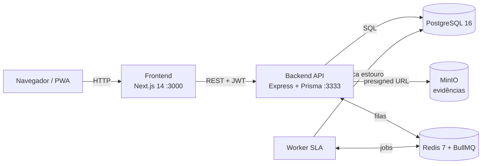
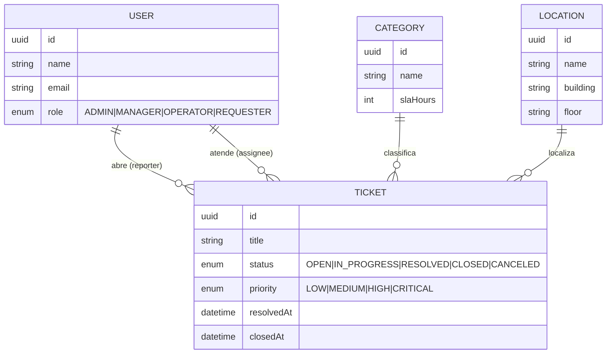

# HelpDesk Operacional


Sistema de gestão de chamados e manutenção de facilities para grandes empresas. Conecta colaboradores (que reportam problemas físicos — manutenção, limpeza, reposição de insumos) à equipe operacional, com validação visual (fotos antes/depois) e controle rigoroso de SLA.

> **Disciplina:** GCC267 - Projeto Integrador I (UFLA, 2026/1)
> **Professor:** Dr. Rafael Serapilha Durelli
> **Sprint 1 — entrega 22/04/2026**

## Objetivo do produto

Reduzir o tempo entre o relato de um incidente físico e sua resolução em ambientes corporativos, criando:

- um canal único para solicitantes abrirem chamados com fotos de evidência;
- um backlog priorizado por SLA para a equipe operacional atender no app mobile/PWA;
- um dashboard executivo para gestores acompanharem indicadores (chamados abertos, SLA estourado, carga por time).

## Integrantes

| Papel | Nome | GitHub |
|---|---|---|
| Tech Lead + Backend Auth | Lucas Henrique Lopes Costa | [@Lucas-Henrique-Lopes-Costa](https://github.com/Lucas-Henrique-Lopes-Costa) |
| Backend — Domínio de Chamados | Pedro Gonçalves Costa Melo | [@Pedro-Goncalves-Costa-Melo](https://github.com/Pedro-Goncalves-Costa-Melo) |
| Frontend Web | Thiago Lima Pereira | [@thiagolimapereira](https://github.com/thiagolimapereira) |
| RBAC + CI/CD + QA | Gustavo Teodoro | [@tteodorogustavo](https://github.com/tteodorogustavo) |

## Stack

- **Backend:** Node.js 20 · Express 4 · TypeScript 5 · Prisma 5 · JWT · Zod · Jest
- **Frontend:** Next.js 14 (App Router) · React 18 · Tailwind CSS
- **Banco:** PostgreSQL 16
- **Filas/Cache:** Redis 7 + BullMQ (notificações, processamento de imagens, monitor de SLA)
- **Storage:** MinIO (S3-compatível, evidências dos chamados)
- **Infra local:** Docker + Docker Compose
- **CI:** GitHub Actions

## Arquitetura

Aplicação em containers orquestrados por Docker Compose. O frontend (Next.js) consome a API REST (Express), que persiste no Postgres via Prisma, guarda evidências no MinIO (S3-compatível) e usa Redis/BullMQ para o monitor de SLA e notificações.



### Modelo de entidades (atual)



> Entidades de evidências (`TicketAttachment`), comentários (`Comment`) e os campos de SLA (`dueAt`) são adicionados nos épicos do Sprint 2 (issues [#30](https://github.com/Lucas-Henrique-Lopes-Costa/HelpDesk/issues/30)).

## Como rodar localmente

**Pré-requisitos:** Docker e Docker Compose (para o caminho recomendado); Node.js 20+ (para desenvolvimento).

### Opção A — Stack completa com Docker (recomendado para a demo)

Sobe **tudo** (frontend + backend + Postgres + Redis + MinIO) com um comando. As migrations e o seed (usuário admin, locais e categorias) rodam automaticamente no boot do backend.

```bash
git clone https://github.com/Lucas-Henrique-Lopes-Costa/HelpDesk.git
cd HelpDesk
cp .env.example .env
docker compose up --build
```

- Frontend: <http://localhost:3000>
- API / Swagger: <http://localhost:3333/docs>
- Console do MinIO: <http://localhost:9001>
- Login do seed: `admin@helpdesk.local` / `helpdesk123`

### Opção B — Desenvolvimento (hot reload local + infra em Docker)

```bash
# 1. Apenas a infra em Docker (Postgres, Redis, MinIO)
cp .env.example .env
docker compose up -d postgres redis minio

# 2. Backend
cd backend
cp .env.example .env
npm install
npm run prisma:generate
npm run prisma:migrate
npm run prisma:seed
npm run dev  # sobe em http://localhost:3333

# 3. Frontend (em outro terminal, na raiz do projeto)
cd frontend
cp .env.local.example .env.local
npm install
npm run dev  # sobe em http://localhost:3000
```

Healthcheck do backend: `curl http://localhost:3333/health`.
Documentação interativa (Swagger): <http://localhost:3333/docs>.
Frontend: abra <http://localhost:3000>. As credenciais do seed são `admin@helpdesk.local` / `helpdesk123`.

### Modo mock do frontend (sem backend)

Para navegar por **todas** as telas sem subir Postgres/Redis/MinIO/backend, edite `frontend/.env.local`:

```
NEXT_PUBLIC_API_URL=http://localhost:3333
NEXT_PUBLIC_USE_MOCK=true
```

Com o flag ligado, um backend em memória (`src/lib/mock-db.ts`) implementa o mesmo
contrato dos endpoints reais — incluindo **login**, detalhe do chamado, comentários,
evidências (antes/depois), atribuição, SLA e o `GET /tickets/stats`. Os dados vivem em
memória e são reiniciados a cada reload da página. Ideal para a demo offline da banca.

**Login mockado:** qualquer senha é aceita e o **papel é derivado do e-mail**, para
exercitar o RBAC das telas:

| E-mail | Papel | Enxerga |
|---|---|---|
| `admin@helpdesk.local` | ADMIN | tudo (Chamados, Fila, Indicadores) |
| `gestor@helpdesk.local` | MANAGER | tudo + atribuição |
| `carlos@helpdesk.local` | OPERATOR | Chamados, Fila (assume chamados) |
| `maria@helpdesk.local` | REQUESTER | abre chamados / vê os próprios |

> Em produção (`NEXT_PUBLIC_USE_MOCK=false`) as mesmas telas consomem a API real; basta
> apontar `NEXT_PUBLIC_API_URL` para o backend publicado.

## Scripts do backend

| Comando | Descrição |
|---|---|
| `npm run dev` | Hot reload (tsx watch) |
| `npm run build` | Compila para dist/ |
| `npm run start` | Executa a build |
| `npm test` | Testes unitários (Jest) |
| `npm run test:coverage` | Testes + relatório de cobertura |
| `npm run prisma:migrate` | Aplica migrations no banco |

## Scripts do frontend

| Comando | Descrição |
|---|---|
| `npm run dev` | Next.js dev server em <http://localhost:3000> |
| `npm run build` | Build de produção |
| `npm run start` | Serve a build |
| `npm run lint` | ESLint (`next lint`) |

## Deploy

A aplicação foi pensada para rodar em qualquer plataforma com suporte a Docker.

- **Caminho 100% reprodutível (sem nuvem):** `docker compose up --build` na raiz do repositório sobe o produto inteiro (ver _Opção A_ acima). É o caminho usado na demo da banca.
- **Nuvem (Render):** o arquivo [`render.yaml`](render.yaml) é um blueprint Infrastructure-as-Code que provisiona Postgres gerenciado + backend (Docker) + frontend. Importe via **Render → New → Blueprint** apontando para este repositório e ajuste `NEXT_PUBLIC_API_URL` para a URL pública do backend.

> 🔗 **Link do deploy:** _a publicar_ (o blueprint do Render está pronto; a URL pública entra aqui após o deploy).

## Decisões técnicas

As principais decisões de arquitetura estão registradas como ADRs:

- **Stack** (Node/Express/Next/Postgres) e **arquitetura em camadas** — escolhidas no Sprint 1 para merges de baixo atrito entre 4 devs e services testáveis sem banco.
- **SLA com `dueAt` imutável + monitor BullMQ** (ADR-003) — prazo auditável e detecção de estouro assíncrona, reaproveitando o Redis da stack.
- **Evidências em MinIO/S3, metadados no Postgres** (ADR-004) — banco enxuto e caminho de produção (AWS S3) por troca de credenciais.

## Qualidade (SonarCloud)

> 🔗 **Projeto no SonarCloud:** _a publicar_ (configuração no épico de QA — issue [#32](https://github.com/Lucas-Henrique-Lopes-Costa/HelpDesk/issues/32)). Badges de Quality Gate e cobertura entram aqui.

## Documentação

- [ADR-001 — Stack tecnológica](docs/adr/001-stack-tecnologica.md)
- [ADR-002 — Arquitetura em camadas do backend](docs/adr/002-arquitetura-em-camadas.md)
- [ADR-003 — Política de SLA dos chamados](docs/adr/003-politica-de-sla.md)
- [ADR-004 — Storage de evidências (fotos antes/depois)](docs/adr/004-storage-de-evidencias.md)
- [Retrospectiva do Sprint 1](docs/retrospectivas/sprint1.md) (Gustavo)

## Gestão

- **GitHub Project:** [Sprint 1 — HelpDesk Operacional](https://github.com/users/Lucas-Henrique-Lopes-Costa/projects/5)
- **Milestone:** `Sprint 1 - Fundação do Produto`
- **Definition of Done do Sprint 1:** repositório estruturado, 3 User Stories demonstráveis (US-01 Auth, US-02 Abertura de chamado, US-03 Dashboard), suíte de testes verde, 1 PR por integrante mergeado em `main`.
